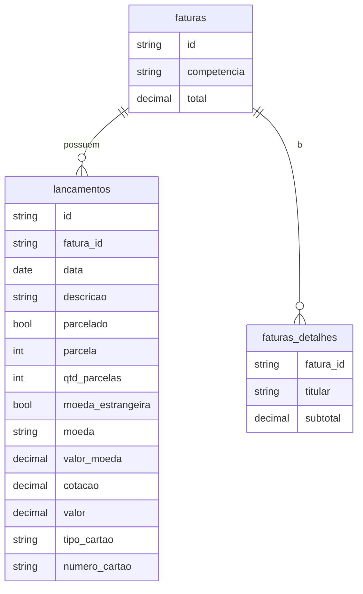

---
Financeiro Diagrama ER
---

```mermaid
erDiagram

faturas {
    string id
    string competencia
    decimal total
}

faturas_detalhes {
    string fatura_id
    string titular
    decimal subtotal
}

lancamentos {
    string id
    string fatura_id
    date data
    string descricao
    bool parcelado
    int parcela
    int qtd_parcelas
    bool moeda_estrangeira
    string moeda
    decimal valor_moeda
    decimal cotacao
    decimal valor
    string tipo_cartao
    string numero_cartao
}


faturas ||--o{ lancamentos : possuem
faturas ||--o{ faturas_detalhes : b

```