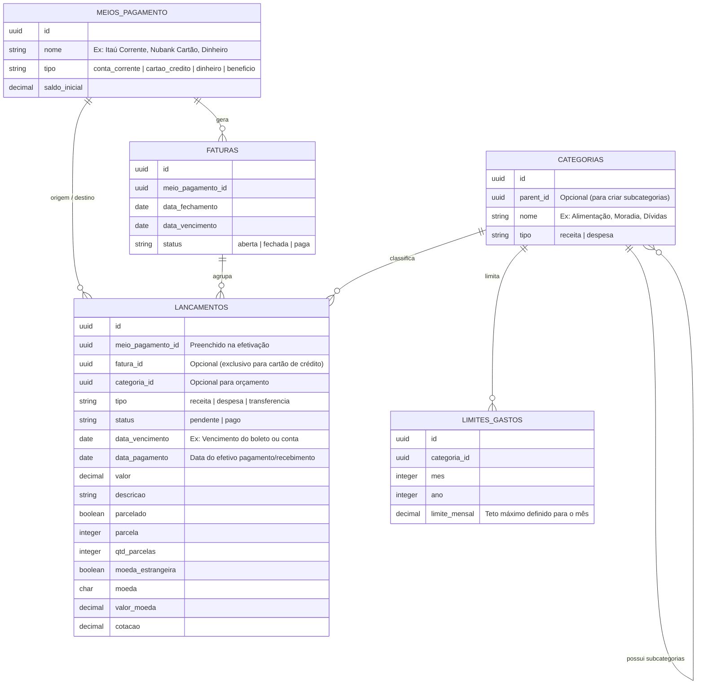

```mermaid
erDiagram
    MEIOS_PAGAMENTO ||--o{ FATURAS : gera
    MEIOS_PAGAMENTO ||--o{ LANCAMENTOS : "origem / destino"
    FATURAS ||--o{ LANCAMENTOS : agrupa
    CATEGORIAS ||--o{ LANCAMENTOS : classifica
    CATEGORIAS ||--o{ LIMITES_GASTOS : limita
    CATEGORIAS ||--o{ CATEGORIAS : "possui subcategorias"

    MEIOS_PAGAMENTO {
        uuid id
        string nome "Ex: Itaú Corrente, Nubank Cartão, Dinheiro"
        string tipo "conta_corrente | cartao_credito | dinheiro | beneficio"
        decimal saldo_inicial
    }

    FATURAS {
        uuid id
        uuid meio_pagamento_id
        date data_fechamento
        date data_vencimento
        string status "aberta | fechada | paga"
    }

    CATEGORIAS {
        uuid id
        uuid parent_id "Opcional (para criar subcategorias)"
        string nome "Ex: Alimentação, Moradia, Dívidas"
        string tipo "receita | despesa"
    }

    LANCAMENTOS {
        uuid id
        uuid meio_pagamento_id "Preenchido na efetivação"
        uuid fatura_id "Opcional (exclusivo para cartão de crédito)"
        uuid categoria_id "Opcional para orçamento"
        string tipo "receita | despesa | transferencia"
        string status "pendente | pago"
        date data_vencimento "Ex: Vencimento do boleto ou conta"
        date data_pagamento "Data do efetivo pagamento/recebimento"
        decimal valor
        string descricao
        boolean parcelado
        integer parcela
        integer qtd_parcelas
        boolean moeda_estrangeira
        char moeda
        decimal valor_moeda
        decimal cotacao
    }

    LIMITES_GASTOS {
        uuid id
        uuid categoria_id
        integer mes
        integer ano
        decimal limite_mensal "Teto máximo definido para o mês"
    }
```