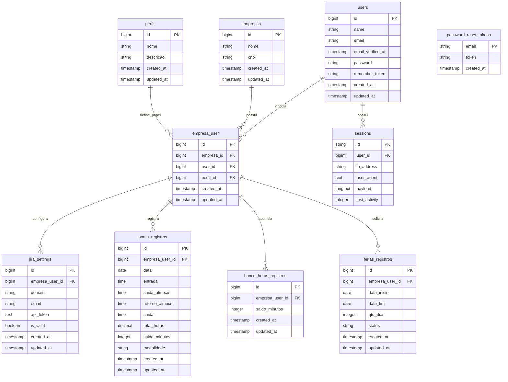

---
Diagrama de ER
---

```mermaid
erDiagram
    users {
        bigint id PK
        string name
        string email
        timestamp email_verified_at
        string password
        string remember_token
        timestamp created_at
        timestamp updated_at
    }

    empresas {
        bigint id PK
        string nome
        string cnpj
        timestamp created_at
        timestamp updated_at
    }

    perfis {
        bigint id PK
        string nome
        string descricao
        timestamp created_at
        timestamp updated_at
    }

    empresa_user {
        bigint id PK
        bigint empresa_id FK
        bigint user_id FK
        bigint perfil_id FK
        timestamp created_at
        timestamp updated_at
    }

    jira_settings {
        bigint id PK
        bigint empresa_user_id FK
        string domain
        string email
        text api_token
        boolean is_valid
        timestamp created_at
        timestamp updated_at
    }

    ponto_registros {
        bigint id PK
        bigint empresa_user_id FK
        date data
        time entrada
        time saida_almoco
        time retorno_almoco
        time saida
        decimal total_horas
        integer saldo_minutos
        string modalidade
        timestamp created_at
        timestamp updated_at
    }

    banco_horas_registros {
        bigint id PK
        bigint empresa_user_id FK
        integer saldo_minutos
        timestamp created_at
        timestamp updated_at
    }

    ferias_registros {
        bigint id PK
        bigint empresa_user_id FK
        date data_inicio
        date data_fim
        integer qtd_dias
        string status
        timestamp created_at
        timestamp updated_at
    }

    password_reset_tokens {
        string email PK
        string token
        timestamp created_at
    }

    sessions {
        string id PK
        bigint user_id FK
        string ip_address
        text user_agent
        longtext payload
        integer last_activity
    }

    users ||--o{ sessions : possui
    users ||--o{ empresa_user : vincula
    empresas ||--o{ empresa_user : possui
    perfis ||--o{ empresa_user : define_papel

    empresa_user ||--o{ jira_settings : configura
    empresa_user ||--o{ ponto_registros : registra
    empresa_user ||--o{ banco_horas_registros : acumula
    empresa_user ||--o{ ferias_registros : solicita
```